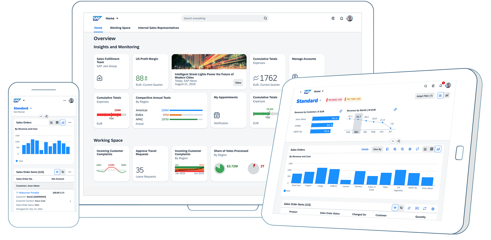

## Section 1: Introduction to SAP Fiori and SAPUI5

### 🌟 What is SAP Fiori?

<i>Source: <a href="https://experience.sap.com/fiori-design-web/" target="_blank">SAP Fiori Design Guidelines</a></i>

#### 🚀 The User Experience (UX) for SAP Software
SAP Fiori is more than just a user interface—it's a *revolutionary design philosophy* that transforms how users interact with SAP software. Here's what makes it stand out:

* **🎭 Role-Based:** Tailored to show only the most relevant information and tasks for each user's role.
* **📱 Adaptive:** Delivers a seamless experience across devices—desktop, tablet, or mobile.
* **✨ Simple:** Focused on essential tasks with an intuitive and clutter-free design.
* **🔗 Coherent:** Ensures a consistent experience across all SAP applications.
* **🎉 Delightful:** Makes work enjoyable with visually appealing and engaging designs.

SAP Fiori is the UX foundation for S/4HANA, C/4HANA, SuccessFactors, Ariba, and even custom-built apps.

---

#### 🌟 Key Features & Benefits of Fiori

* **🚀 Boosted Productivity:** Simplified screens and workflows enable faster task completion.
* **👍 Higher User Adoption:** Easy to learn and use, reducing the need for extensive training.
* **🌍 Work Anywhere:** Device-agnostic design ensures flexibility to work on any device, anytime.
* **🎨 Unified Look & Feel:** A consistent design reduces confusion and strengthens branding.
* **⚡ Accelerated Development:** SAPUI5 tools and frameworks speed up app deployment.
* **🌐 Modern Web Standards:** Built on HTML5, CSS3, and JavaScript for a future-proof experience.

---

### 🌐 What is SAPUI5?

<i>Source: <a href="https://sap.github.io/ui5-tooling/stable/" target="_blank">SAPUI5 Tooling</a></i>

SAPUI5 is SAP's **UI Development Toolkit for HTML5**, a powerful JavaScript framework for building modern, responsive, and enterprise-ready web applications. Here's what makes it indispensable:

* **💡 Rich UI Controls:** A comprehensive library of buttons, tables, charts, and more.
* **🏗️ MVC Architecture:** Built on the robust Model-View-Controller design pattern.
* **🔗 Advanced Data Binding:** Seamlessly integrates with OData, JSON, and XML data sources.
* **🎨 Theming & Branding:** Easily customize the look and feel to match your brand.
* **🌍 Built-in Features:** Includes routing, internationalization (i18n), and more out of the box.
> **OpenUI5:** The open-source sibling of SAPUI5, sharing the same core framework.

<iframe width="560" height="315" src="https://www.youtube.com/embed/6_CQYtmRJNg?si=8UrH5KpNWFRDcVYc" title="SAPUI5 Overview" frameborder="0" allow="accelerometer; autoplay; clipboard-write; encrypted-media; gyroscope; picture-in-picture; web-share" referrerpolicy="strict-origin-when-cross-origin" allowfullscreen></iframe>

---

### 🔍 Fiori vs. SAPUI5 - What's the Difference?

* **SAP Fiori:**
    * A **UX Strategy** and **Design Language**.
    * Provides guidelines and principles for building user-friendly applications.
    * Includes a suite of standard apps (e.g., My Inbox, Manage Purchase Orders).
    * Represents the *end-user experience*.

* **SAPUI5:**
    * A **Technology Framework**.
    * A JavaScript library and development toolkit.
    * The *toolset* used to create Fiori-compliant applications.
    * Represents the *code and logic* behind the scenes.

**💡 Analogy:** Think of Fiori as the *architectural blueprint and interior design guide* for a house, while SAPUI5 is the *construction company, tools, and materials* used to bring that vision to life.