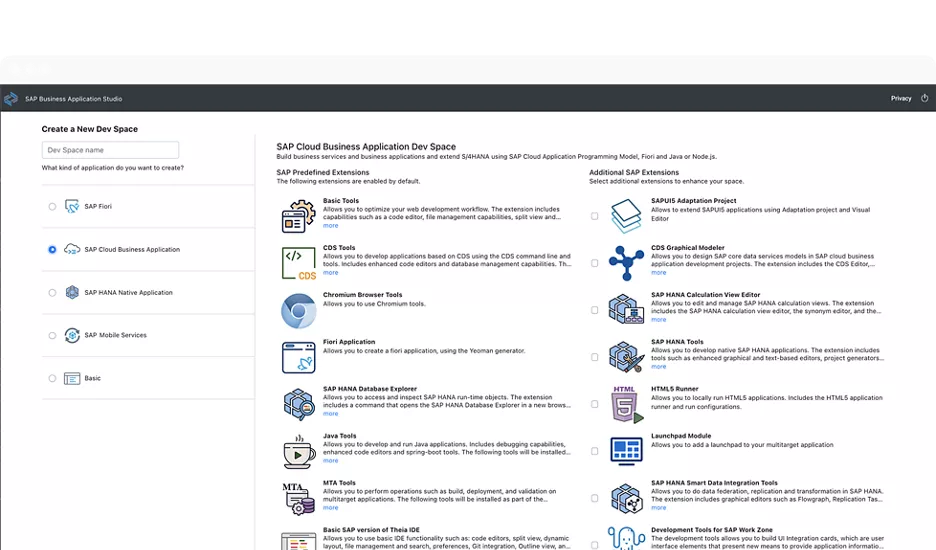
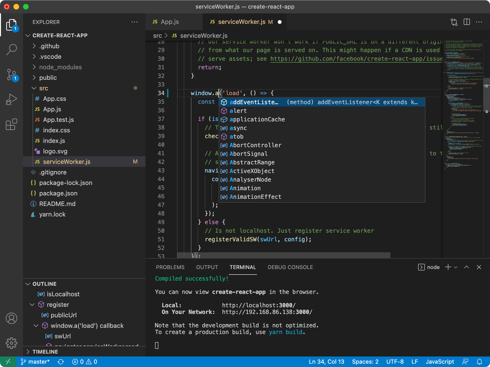

## Section 2: Setting Up the Development Environment

### 🛠️ Required Tools & Software

#### 🌟 **Primary Recommendation: SAP Business Application Studio (BAS)**
- A cloud-based IDE provided by SAP, designed specifically for SAP development (Fiori, CAP, HANA).
- Comes preloaded with Fiori tools, templates, and runtimes.
- **Prerequisite:** A SAP BTP Account (Trial or Enterprise).
- **Why BAS?** Simplifies setup and offers a seamless development experience.

#### 💻 **Alternative: Visual Studio Code (VS Code) + Extensions**
- A popular, free, and lightweight local IDE.
- **What You'll Need:**
    - **Node.js & npm:** JavaScript runtime and package manager.
    - **SAP Fiori tools Extension Pack:** Available on the VS Code Marketplace.
- **Why VS Code?** Great for offline work, though setup requires more effort.

#### 🌐 **Web Browser with Developer Tools**
- Essential for debugging! Recommended browsers: **Chrome**, **Edge**, or **Firefox**.

---

### 📖 Setup Guide: **SAP Business Application Studio (Recommended)**

<i>Image Source: <a href="https://www.sap.com/canada/products/technology-platform/business-application-studio.html" target="_blank">SAP Business Application Studio</a></i>

1. **Log in to SAP BTP Cockpit:** Use your Trial or Enterprise account.
2. **Navigate to Subaccount:** Select the subaccount with your entitlements.
3. **Find Subscriptions/Instances:** Locate "SAP Business Application Studio".
4. **Create a Dev Space:**
     - Click "Create Dev Space".
     - Name it (e.g., `Fiori_Dev`).
     - Choose **"SAP Fiori"** as the application type.
     - (Optional) Add extra extensions if needed.
     - Click "Create Dev Space".
5. **Launch BAS:** Wait for the Dev Space to start running, then click its name to open BAS.

---

### 📖 Setup Guide: **Visual Studio Code (Alternative)**

<i>Image Source: <a href="https://github.com/microsoft/vscode" target="_blank">GitHub - Visual Studio Code</a></i>

1. **Install VS Code:** Download and install from [code.visualstudio.com](https://code.visualstudio.com/).
2. **Install Node.js & npm:**
     - Download the LTS version from [nodejs.org](https://nodejs.org/).
     - Verify installation in your terminal: `node -v` and `npm -v`.
3. **Add SAP Fiori Tools Extension Pack:**
     - Open VS Code.
     - Go to the Extensions view (`Ctrl+Shift+X`).
     - Search for "SAP Fiori tools" and install the Extension Pack.
4. **(Optional) Install Git:** For version control, download from [git-scm.com](https://git-scm.com/).

---

### 🌟 Best Practices for Your Development Environment

- **🚀 Start Smart:** Use BAS wizards or Fiori Tools commands (`F1` -> `Fiori: Open Application Generator`) to generate projects. Avoid manual setups.
- **🔄 Version Control:** Use Git from day one. Commit your changes frequently.
- **📦 Stay Updated:** Regularly update BAS extensions, VS Code extensions, and Node.js (ensure compatibility before updating).
- **📂 Master Key Files:**
    - `package.json`: Manages dependencies.
    - `ui5.yaml`: Configures build and runtime settings.
- **🔍 Debug Like a Pro:** Use browser developer tools to inspect elements, monitor network requests, and analyze console logs.

---

🎉 **Ready to Build?** Choose your preferred setup and let's start creating amazing SAPUI5 applications!